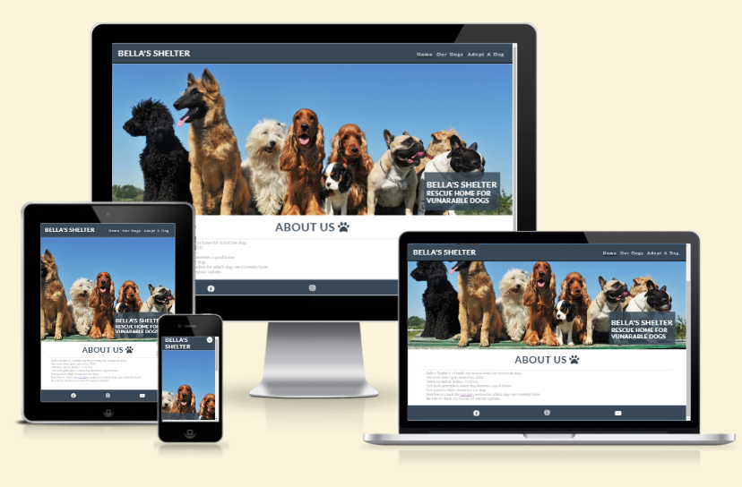
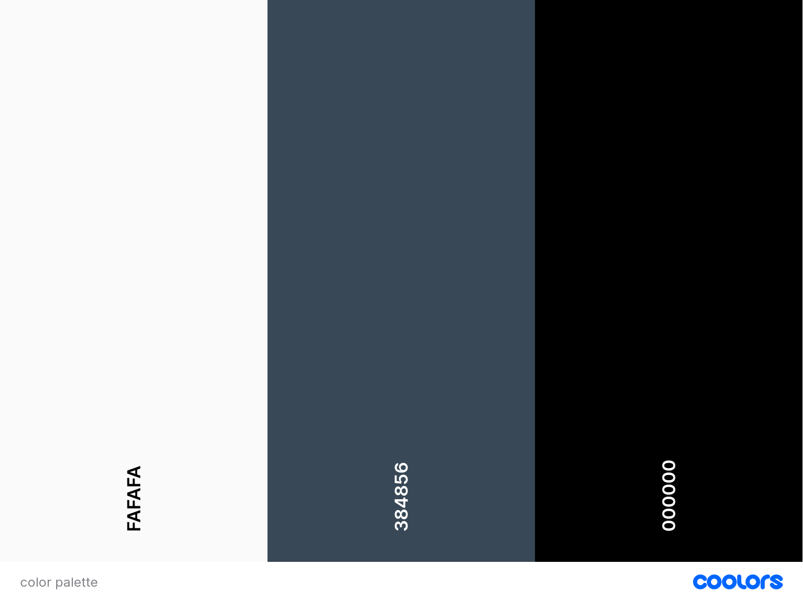
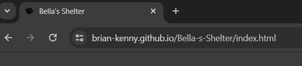
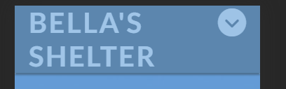
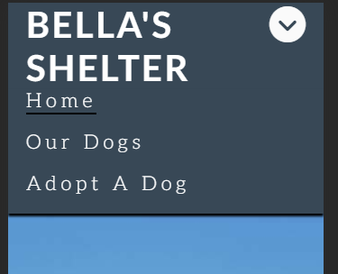
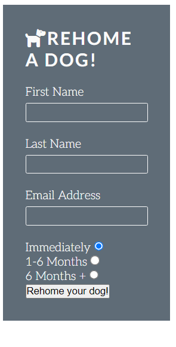

# Bella's Shelter (PP1)

Bella's Shelter is a responsive website for all users. Connecting people looking to rehome a dog, with one of our rescue dogs. 
Our goal is to find a loving home for all our dogs.

## CONTENTS 

## User Experience (UX)

### Initial Discussion

Bella's Shelter is an online website, that provides information on local rescue dogs looking for a new home. The site is a easy way of communicating with our shelter.

#### Key information for site

* Current rescue dogs available.
* Ability to adopt a dog.
* Links to social media for updates.

### User Stories

#### Client Goals

* Responsive website. 
* Easy to navigate.
* Update current dogs that are available to adopt.
* Allow people to fill out form for a dog adoption.
* Provide updates of the shelter.
* Find dogs loving homes.

#### First Time Visitor Goals

* To find out information about Bella's Shelter.
* Easily navigate site.
* Look through pictures of current dogs.
* Find links to relavent social media.

#### Returning Visitor Goals 

* Find up to date information.
* Easily contact the shelter. 

#### Frequenet Visitor Goals

* Keep up to date with current dogs.
* Look at new images added to gallery.
* Easily contact the shelter.

## Design 

### Color Scheme

The site uses a relaxing palette. That is visually pleasing and provides a good contrast for fonts and backgrounds.

### Typography

Google fonts was used to import the Lato and Aleo fonts. Both are sans-serif and provide a pleasing reading experience.

### Imagery 

All imagery was found from multiple wesbites, all named and credited in the Credits section.

### Wireframes

## Features 

The website contains 3 pages, home page, our dogs page and adopt a dog page.

A favicon is shown on each page on the browser tab.

* Index
  * Created a toggle dropdown menu for mobile and small screen users

* Adopt a dog
  * Functioning submit form for collecting information of users who are interested in adopting a dog.

