# Bella's Shelter (PP1)

Bella's Shelter is a responsive website for all users. Connecting people looking to rehome a dog, with one of our rescue dogs. 
Our goal is to find a loving home for all our dogs.

## CONTENTS 

## User Experience (UX)

### Initial Discussion

Bella's Shelter is an online website, that provides information on local rescue dogs looking for a new home. The site is a easy way of communicating with our shelter.

#### Key information for site

* Current rescue dogs available.
* Ability to adopt a dog.
* Links to social media for updates.

### User Stories

#### Client Goals

* Responsive website. 
* Easy to navigate.
* Update current dogs that are available to adopt.
* Allow people to fill out form for a dog adoption.
* Provide updates of the shelter.
* Find dogs loving homes.

#### First Time Visitor Goals

* To find out information about Bella's Shelter.
* Easily navigate site.
* Look through pictures of current dogs.
* Find links to relavent social media.

#### Returning Visitor Goals 

* Find up to date information.
* Easily contact the shelter. 

#### Frequenet Visitor Goals

* Keep up to date with current dogs.
* Look at new images added to gallery.
* Easily contact the shelter.

## DESIGN 

### Color Scheme

The site uses a relaxing palette. That is visually pleasing and provides a good contrast for fonts and backgrounds.

### Typography

Google fonts was used to import the Lato and Aleo fonts. Both are sans-serif and provide a pleasing reading experience.

### Imagery 

All imagery was found from multiple wesbites, all named and credited in the Credits section.

### Wireframes

My original ideas for the layout of the site, with a mobile first mindset.

* Index

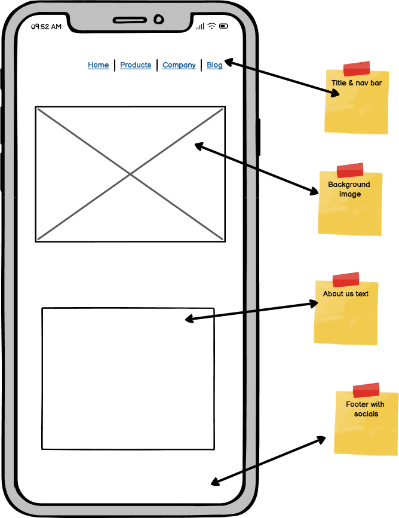

* Our Dogs

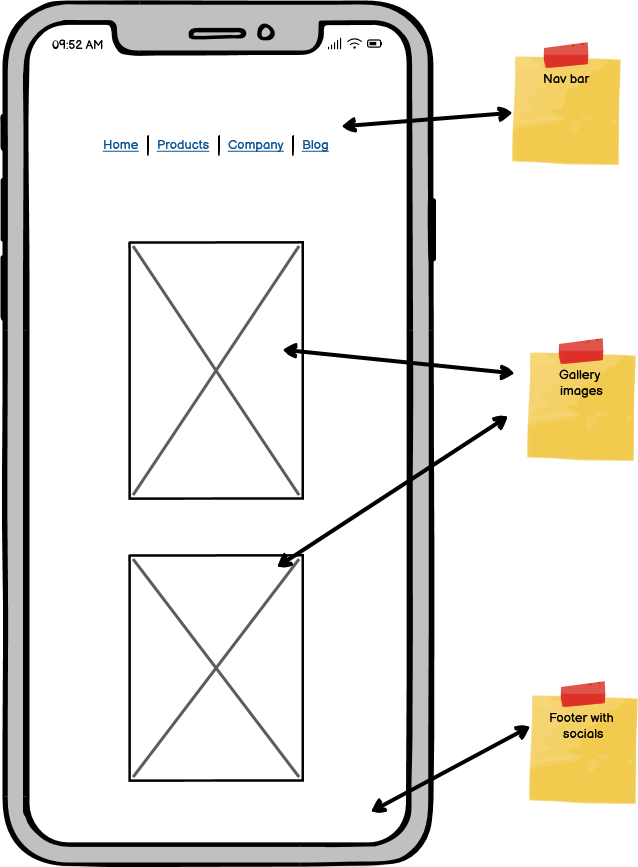

* Adopt 

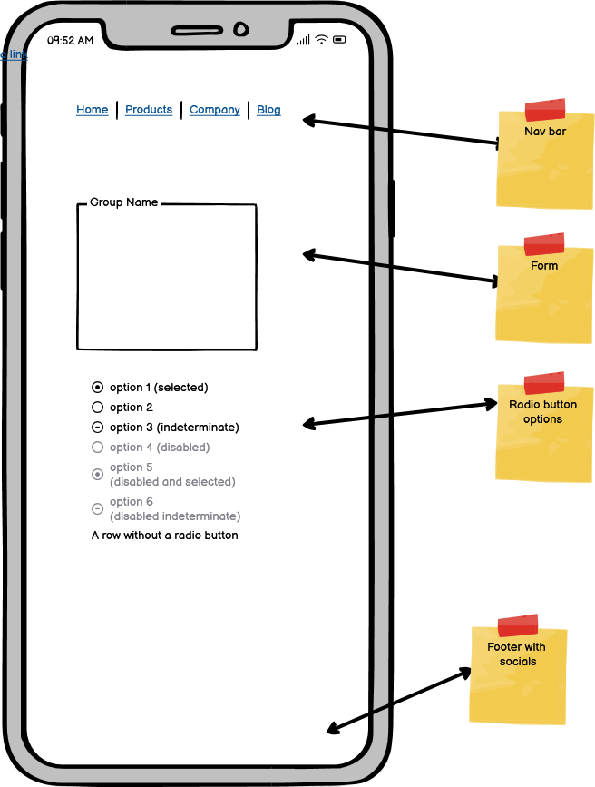
## FEATURES 

The website contains 3 pages, home page, our dogs page and adopt a dog page.

A favicon is shown on each page on the browser tab.

* Index
  * Created a toggle dropdown menu for mobile and small screen users

* Adopt a dog
  * Functioning submit form for collecting information of users who are interested in adopting a dog.

* Footer 
  * A fixed footer with social media hrefs.

  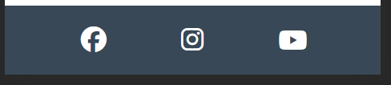

  ## TESTING

  ### Validator Testing 

  * HTML
    * Index: No errors were returned when passing through the official W3C validator (direct source method).
    
    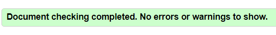

    * Our Dogs: No errors were returned when passing through the official W3C validator (direct source method).

    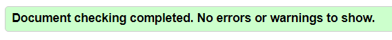

    * Adopt A Dog: No errors were returned when passing through the official W3C validator (direct source method).

    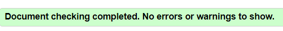

   * CSS
     *  No errors were found when passing through the official Jigsaw validator (direct source method).

     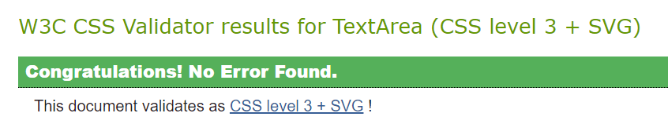

     ### User Stories Testing
     
     * First Time Users

     First time users can easily navigate the site, with the fixed nav bar and drop down toggle menu.

     * Returning Visitors 

     Returning visitors can simply find up to date information by visiting the site. They can contact the shelter with the provided social media links fixed to the footer.

     ### Accessibility Testing

     To check the colors and fonts I used the lighthouse in the Google devtools. The results are shown below:

     * Index 

     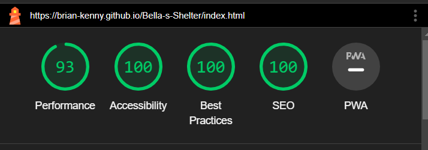

     * Our Dogs

     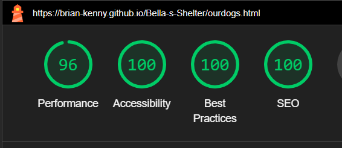

     * Adopt A Dog

     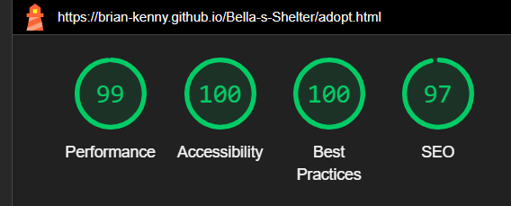

     ### Manual Testing

     * I have tested that this page works in different web browsers.
     * I have tested that the project is responsive and works with different device sizes. It looks good and functions as normal.
     * I have tested all links, internal and external. They go to the correct destination and open in the correct way.
     * I have tested that all text and fonts are readable and easy to understand.

     ### Fixed Bugs

     ## DEPLOYMENT
     
     ### Fork

     1. On GitHub.com, navigate to the [brian-kenny/Bella-s-Shelter](https://github.com/brian-kenny/Bella-s-Shelter) repository.
     2. In the top-right corner of the page, click Fork.
     3. By default, forks are named the same as their parent repositories. You can change the name of the fork to distinguish it further.
     4. Add a description to your fork.
     5. Click Create fork.

     ### Clone

     1. Above the list of files click the button that says 'Code'.
     2. Copy the URL for the repository.
     3. Open Terminal. Change the directory to the location where you want the cloned directory.
     4. Type git clone, and then paste the URL.
     5. Press Enter.

     ### Local Deployment

     1. Sign up to [Gitpod](https://www.gitpod.io/).
     2. Download the Gitpod browser extension.
     3. On GitHub.com, navigate to the [brian-kenny/Bella-s-Shelter](https://github.com/brian-kenny/Bella-s-Shelter) repository.
     4. Above the list of files click the button that says 'Gitpod'.

     ### Remote Deployment

     The site was deployed to Github pages. If you have forked/cloned the repository the steps to deploy are:

     1. On GitHub.com, navigate to your repository.
     2. Navigate to the settings tab
     3. Click on the tab called 'pages' on the left hand side.
     4. From the source drop down list under the heading Build and deployment, select main.
     5. The page will hten provide the link to the website.

     The live link can be found here [Bella's Shelter](https://brian-kenny.github.io/Bella-s-Shelter/index.html)

     ## CREDITS 

     ### Content

     * Processes from the CI Love Running project was used to help create this website [CI Love Running](https://code-institute-org.github.io/love-running-2.0/index.html).
     * HTML and CSS code help was taken from w3schools (https://www.w3schools.com/).

     ### Media 

     * Images were used from [Dog's Trust](https://www.dogstrust.ie/).
     * Images also were taken from [Irish Kennel Club](https://www.ikc.ie/).

     ### Icons

     * All icons were used from [Font Awesome](https://fontawesome.com/).

    

